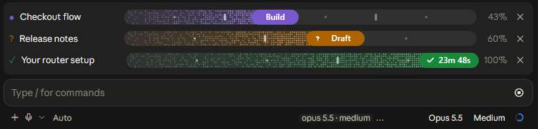
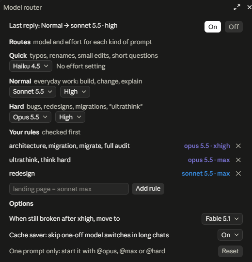

# Cockpit

**Instruments and controls for Claude Code: see where every task is, and choose which model and effort handles it.**



- **Progress**: live bars above your prompt. Claude's own todo list becomes a bar automatically, so tracking progress costs zero extra tokens.
- **Router**: you pick a model and effort for quick, normal and hard prompts in a small panel, and every prompt runs on the one that fits.

## Install

In Claude Code:

```
/plugin marketplace add Brxerq/claude-cockpit
/plugin install cockpit@claude-cockpit
```

Start a new session afterwards. Cockpit is built on Claude Code's function-hook mods, so it needs a Claude Code build that has them. The pixel bars draw in the desktop app; the terminal gets a text bar.

## What it costs

| Part | Tokens |
|---|---|
| Router | **0**. It runs on your machine; the model never sees it. `@tags` are stripped before sending. |
| Bars from Claude's todo list | **0** extra. Claude already writes that list; Cockpit only draws it. |
| Rules in the system prompt | About 40 tokens, read from the prompt cache |
| Named-stage bars (optional) | A short tool call, about once per stage, only on long tasks |

Cockpit never adds reminders to the conversation, never refuses an edit, and never sends Claude back at the end of a turn.

## The router

You decide which model and effort handles each kind of prompt. Cockpit sorts every prompt you type into one of three kinds:

| Kind | Sorted here when you write |
|---|---|
| **Quick** | rename, typo, change the text or colour, a short question |
| **Normal** | everything else: build, add, change, explain |
| **Hard** | bug, error, broken, slow, refactor, redesign, migration, "ultrathink" |

Nothing is picked for you. Until you choose, every kind is set to **Keep**, which leaves your own model and effort alone.

### Set it up



Type `/route` (or click **Set up router** in the footer). A panel opens with a Model and an Effort dropdown for each kind (Keep leaves your own setting). Your choice is saved for every project.

Prefer typing? The same in one line each:

```
/route set quick haiku
/route set normal sonnet medium
/route set hard opus high
```

### Your own rules

Want "redesign" on Sonnet max and "architecture" on Opus xhigh? Add rules. They are checked before the three kinds:

```
/route rule redesign = sonnet max
/route rule architecture, migration, full audit = opus xhigh
/route rule ultrathink, think hard = opus max
/route rule remove redesign
```

"yes", "ok" and "continue" repeat the last choice. "still broken" or "same error" steps up: Quick to Normal, Normal to Hard, then one effort level at a time up to xhigh. Past xhigh it goes to max, or to the model you pick with `/route stuck fable`. Only the first 300 characters count, so a pasted log full of the word "error" does not make a small request hard.

### One prompt only

Start a prompt with tags. Cockpit strips them before sending, so they cost nothing:

```
@opus @high refactor the auth module
@quick bump the version
```

Tags: `@haiku @sonnet @opus @fable`, `@low @medium @high @xhigh @max`, `@quick @normal @hard`.

### Commands

| Command | Does |
|---|---|
| `/route` | Opens the panel |
| `/route set hard opus high` | Sets one kind by command |
| `/route test <prompt>` | Shows which kind a prompt is, without sending it |
| `/route stats` | Tokens and cache hits per model, and the session cost |
| `/route rule redesign = sonnet max` | Adds one of your rules |
| `/route stuck fable` | Where "still broken" goes past xhigh |
| `/route saver off` | Always switch, even in long chats (see below) |
| `/route on`, `/route off`, `/route clear` | Turn routing on or off, or clear all your choices |

Everything is saved in one file, `~/.claude/cockpit.json`, which the panel and the commands edit and you can edit by hand. A full example:

```json
{
  "routes": { "quick": "haiku", "normal": "sonnet high", "hard": "opus high" },
  "rules": [
    { "words": ["architecture", "migration", "full audit"], "route": "opus xhigh" },
    { "words": ["ultrathink", "think hard"], "route": "opus max" },
    { "words": ["redesign"], "route": "sonnet max" }
  ],
  "top": "fable",
  "saver": true
}
```

A project can add its own in `.claude/cockpit.json` (same shape; its routes win and its rules come first).

### Protecting the prompt cache

Claude Code caches the conversation per model, so a model switch makes the next reply re-read the whole conversation at full price. Per the [prompt caching docs](https://code.claude.com/docs/en/prompt-caching), Sonnet 5.5, Opus 5.5 and Fable 5.1 keep the cache when only effort changes. So Cockpit:

- Always lets you move to the model you chose for **Normal** prompts. That is a one-time move.
- With the **cache saver** on (the default), a long conversation (past 30k tokens) holds back a one-off trip to another model, unless you asked for it (a tag, "ultrathink", "still broken") or the cache has already expired. The panel says when this happened. Turn it off with `/route saver off` if you always want the exact model.
- Fixes the route at the start of a reply, so tool loops never switch mid-reply. Subagents are never touched.

## Progress bars

- Claude's todo list shows as a `Tasks` bar by itself
- For long tasks with distinct phases, Claude can show named stages instead
- A plan you approve in plan mode becomes a bar
- Four states: running (violet), needs input (amber), error (red), done (green, with the total time)
- Hover the pill for the running time, hover a checkpoint for when it was reached
- Soft sounds when Claude needs a decision, hits an error or finishes (turn them off in the settings)
- Bars are saved per session and come back when you resume it

Commands: `/progress` (hide or show), `/progress-demo`, `/progress-sounds`, `/progress-clear`.

## Good to know

- Cockpit is early (0.6.0). Please open an issue when something looks off.
- The keyword rules are English. Add your own words with `/route word` or the project file.
- Your choices are saved for every project; `/route off` resets when the app restarts.
- `.claude/cockpit.json` is read when a session starts and whenever you change a choice.

## Develop

```
node plugins/cockpit/hooks/route.test.mjs   # router, cache guard, stats
node plugins/cockpit/hooks/plan.test.mjs    # bars and drawing (Node 22+)
claude plugin validate plugins/cockpit
```

## License

MIT. See [LICENSE](LICENSE).
